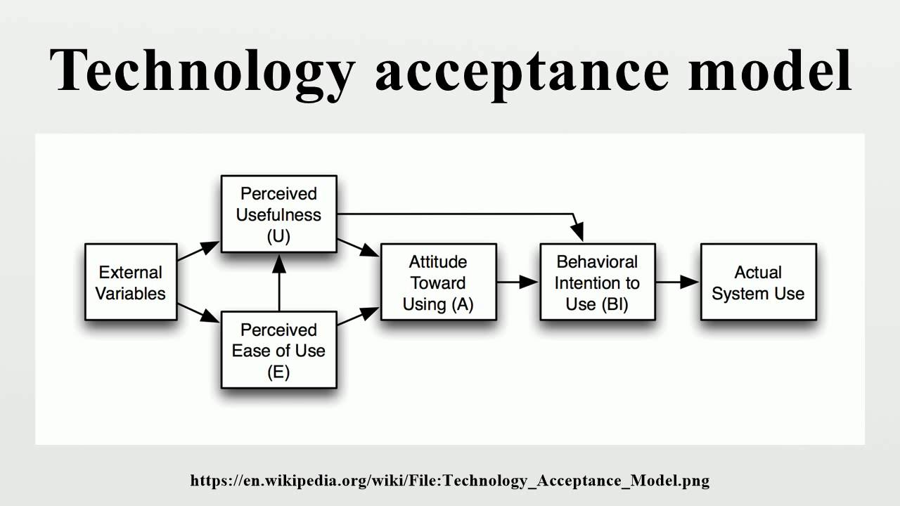

### Chapter 1 - Introduction

Topics Covered:

- Professional software development
  - What is meant by software engineering.
- Software engineering ethics
  - A brief introduction to ethical issues that affect software engineering.
- Case studies
  - An introduction to three examples that are used in later chapters in the book

- The economies of ALL developed nations are dependent on software.
- More and more systems are software controlled
- Software engineering is concerned with theories, methods and tools for professional software development
- Expenditure on software represents a significant fraction of GNP in all developed countries.

##### Software costs
- Software costs often dominate computer systems costs. The costs of software on a PC are often greater than the hardware cost.
- Software costs more to maintain than it does to develop. For systems with a long life, maintenance costs may be several times development costs.
- Software engineering is concerned with cost-effective software development.

### Böhm-Jacopini theorem

[ x ] According to Böhm-Jacopini theorem, an algorithm can be written using only three statements:

  1. sequence
  2. selection
  3. iteration

- - -

### Software Project Failure
- Increasing system complexity
  - As new software engineering technique help us to build larger, more complex systems, the demands change. Systems have to be built and delivered more quickly; larger, even more complex systems are required; systems have to have new capabilities that were previously thought to be impossible.

  - Failure to use software engineering methods
    - It is fairly easy to write computer programs without using software engineering methods and techniques. Many companies have drifted into software development as their products and services have evolved. They do not use software engineering methods in their everyday work. Consequently, their software is often more expensive and less reliable than it should be.

### Frequently asked questions about software engineering
What is software ?
  - Computer programs and associated documentation. Software products may be developed for a particular customer or m ay be developed for a general market.

What are the attributes of good software?
  - Good software should deliver the required functionality and performance to the user and should be maintainable.

### TAM ( technology Acceptance Model)
- The technology acceptance model (TAM) is an information systems theory that models how users come to accept and use a technology. ... Perceived ease-of-use (PEOU) – Davis defined this as "the degree to which a person believes that using a particular system would be free from effort" (Davis 1989).

  1. Perceived usefulness
  2. Perceived ease-of-use

- - -

- - -
