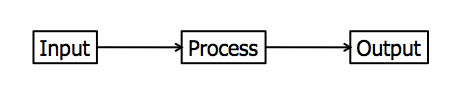

### 0 & 1
- - -

### Law of the Hammer
- if all you have is a hammer, everything looks like a nail

With limited tools, single-minded people apply them inappropriately or indiscriminately

If a person is familiar with a certain, single subject, or has with them a certain, single instrument, they may have a confirmation bias to believe that it is the answer to/involved in everything.

In the software world, you need an arsenal of toolset

### Law of use of tools
- If you don't know how to break a tool in three ways, you don't know that tool.

### Law of unintended consequences
- The law of unintended consequences, often cited but rarely defined, is that actions of people—and especially of government—always have effects that are unanticipated or unintended.

### Systems
Every system in the world has an: I (input) <--> P (process) <--> O (output)

`Conventional and assistive computer technologies are similar in that both employ the core concepts of input, information processing, and output (ATA, 2000). Understanding these concepts is essential to understanding how AT helps individuals with disabilities access a computer.  Each system first must have a means to input information.  This information is then processed.  From the processed information, the computer produces some type of output. Input or output devices can be modified to provide access to individuals with disabilities who cannot use standard input or output devices. To provide a better understanding of input, output, and processing, these concepts are defined as follows.  

Input - the information entered into a computer system, examples include: typed text, mouse clicks, etc.

Processing - the process of transforming input information into and output.

Output – the visual, auditory, or tactile perceptions  provided by the computer after processing the provided information. Examples include: text, images, sound, or video displayed on a monitor or through speaker as well as text or Braille from printers or embossers.

Input Device – any device that enters information into a computer from a external source. Examples include: keyboards, touch screens, mouse, trackballs, microphones, scanners, etc.   

Processing Device –  the electronics that  process or transform information provided as an input to a computer to an output. Examples include: the Central Processing Unit (CPU), operating systems (e.g. Windows, Apple software), microprocessors (e.g. Intel, Pentium), memory cards (RAM), graphic and other production application or programs (Adobe, Microsoft Word, etc).

Output Device  - a device used by a computer to communicate information in a usable form. Examples include: monitors, speakers, and printers, etc.

The following is an example showing how these three concepts work together: To access a website, the user opens an internet browser and, using the keyboard, enters a web address into the browser (input).  The computer then uses that information to find the correct website (information processing) and the content of the desired site is displayed in the web browser (output).

AT for computer access can be applied by adapting either the input or output component of a computer system. Doing this provides an individual with a disability with a tool that utilizes his or her abilities to access a computer. An example of adapting an input device is providing an individual who does not have use of his or her hands with speech recognition software to enter text into a computer as opposed to a keyboard. As for adapting an output device, an individual with a visual impairment can use either a screen magnifier or screen reader to access output on a computer screen. Information processing, in terms of a computer, does not involve a human element and thus does not require assistive technology adaptations.`
